## 计算机视觉综合实验报告

​												3118311071	林之阳

1. #### 手持相机标定与校正

   1.1.  目标
     - 光学透镜具有固有透视失真，是相机畸变的主要部分，桶形畸变和枕形畸变，会使实际物体的直线在图像中产生弯曲，在手持相机模型中表现为径向畸变

     - 切向畸变，这是由于透镜与成像平面不可能绝对平行造成的。这种畸变会造成图像中的某些点看上去的位置会比我们认为的位置要近一些。

     - 修正以上畸变

       

   

   1.2.  成像过程
     - 要将真实世界中一点$P = \left( {X,Y,Z} \right)$转化为二维图像中一点$p = \left( {u,v} \right)$

     - 从__世界坐标系__到__相机坐标系__到__成像坐标系__到__图像像素坐标系__

       $$
       s\left(\begin{array}{c}\mu\\ \nu \\ 1\end{array}\right) = \left[\begin{array}{ccc}\alpha & 0 &c_x \\ 0 & \beta & c_y \\ 0 & 0 & 1\end{array}\right] \left[\begin{array}{cccc}f&0&0&0\\0&f&0&0\\0&0&1&0\end{array}\right] \left[\begin{array}{cc}R&t\\0^T&1\end{array}\right] \left(\begin{array}{c}X\\Y\\Z\\1\end{array}\right) \\
       = \left[\begin{array}{cccC}f_x&0&c_x&0\\0&f_y&c_y&0\\0&0&1&0\end{array}\right]\left[\begin{array}{cc}R&t\\0^T&1\end{array}\right] \left(\begin{array}{c}X\\Y\\Z\\1\end{array}\right)
       $$

       

     - 其中$K = \left[\begin{array}{ccc}f_x&0&c_x\\0&f_y&c_y\\0&0&1\end{array}\right]$是相机的内参矩阵，$f_x,f_y$为焦距$f$乘以$x,y$方向上单位距离像素个数，$c_x,c_y$为相机图片$x,y$方向上像素的一半

   1.3. 张氏标定法

     - 获取成像平面角点坐标

       采用黑白棋盘标定板作为拍摄对象，寻找棋盘板所在平面$G_1$与相机成像平面$G_2$之间的关系，通过角点检测可以找到棋盘各个角点在图像中的像素位置，又已知每个角点在实际世界空间中的位置关系，依次寻找两平面的单应关系

     - 优化亚像素坐标

       

       对于一角点$q$，在其邻域区间内取任一点$p$，向量$\overrightarrow {qp} $一定与当前点$q$所在邻域内$p$点的灰度梯度方向的转置正交，即$\overrightarrow {qp} {\rm{ }} \cdot {\rm{ }}D{I_p}^T = 0$，于是有待最小化的误差式：
       $$
       \epsilon _i = {DI_{p_i}}^T \cdot (q - p_i)
       $$
       其中${DI_p}^T$是p点的梯度方向转置

     - 根据两平面单应关系和内参约束求解相机内参数
       $$
       \left\{
       \begin{array}{l}h_1^TK^{-T}K^{-1}h_2 = 0 \\ h_1^TK^{-T}K^{-1}h_1 = h_2^TK^{-T}K^{-1}h_2 = 1\end{array}
       \right. \Rightarrow \left\{ \begin{array}{l}v_{22}^Tb = 0 \\ v_{11}b = v_{12}b \end{array}\right.
       $$

       $$
       H =\left[\begin{array}{c}h_1&h_2&h_3\end{array}\right]= \lambda K[\begin{array}{c}r_1&r_2&t\end{array}]
       $$

       图像像素坐标系点$p$与棋盘平面坐标系对应点$P$关系为$p = K[R|t]P$，令$H = K[R|t]$，称H为单应矩阵，即就是两个平面对应点的坐标变换关系。最后根据等式求解得到相机各个内参数

   1.4.  实验结果

   

     

     - 通过预先输入棋盘内角点规格$6\times8$，通过角点检测找到图像上二维像素坐标，并人为规定棋盘所在三维平面，但保证角点间关系不变，实验中以棋盘平面为$x,y$轴所在平面，单位为棋盘一格

       ```python
       #棋盘坐标 每帧图片共6x8=48个角点坐标
       obj_points
       Out[3]: 
       [array([[0., 0., 0.],
               [1., 0., 0.],
               [2., 0., 0.],
               [3., 0., 0.],
               [4., 0., 0.],
               [5., 0., 0.],
               [6., 0., 0.],
               [7., 0., 0.],
               [0., 1., 0.],
               [1., 1., 0.],...
       
       #像素坐标
       img_points
       Out[4]: 
       [array([[[ 387.3338 ,  619.6611 ]],
               [[ 437.60806,  634.4014 ]],
               [[ 490.82437,  649.5558 ]],
               [[ 546.5159 ,  665.54254]],
               [[ 604.10645,  682.2551 ]],
               [[ 664.7508 ,  699.7915 ]],
               [[ 728.5448 ,  718.77496]],
               [[ 797.99634,  737.1094 ]],
               [[ 390.9601 ,  683.7071 ]],
               [[ 440.52267,  699.3147 ]],
               [[ 491.81396,  715.7705 ]],...
       ```

     - 以多张相机对棋盘格拍摄的两坐标系下点坐标为输入，通过标定算法得到

       相机内参矩阵$camera matrix = \left[\begin{array}{ccc}f_x&0&c_x\\0&f_y&c_y\\0&0&1\end{array}\right]$

       失真系数$Distortion \; coefficients=(k_1 \hspace{10pt} k_2 \hspace{10pt} p_1 \hspace{10pt} p_2 \hspace{10pt} k_3)$

       ```python
       #焦距的单位为棋盘格单位
       camera_matrix 
       Out[15]: 
       array([[1535,    0,  542],
              [   0, 1531,  946],
              [   0,    0,    1]], dtype=int64)
       
       distortion_coefficients
       Out[36]: 
       array([[ 4.78400493e-01, -3.93780904e+00, -3.03638428e-03,
                1.73049372e-03,  1.09382378e+01]])
       ```

     - 径向畸变的产生式为
       $$
       x_{distorted} = x( 1 + k_1 r^2 + k_2 r^4 + k_3 r^6) \\ y_{distorted} = y( 1 + k_1 r^2 + k_2 r^4 + k_3 r^6)
       $$
       切向畸变的产生式为
       $$
       x_{distorted} = x + [ 2p_1xy + p_2(r^2+2x^2)] \\ y_{distorted} = y + [ p_1(r^2+ 2y^2)+ 2p_2xy]
       $$

     - 遵从如上二式，以相机内参和失真系数对拍摄的某张棋盘格照片进行校正

   1.5.  结果评估

   

   ​                                                                           已修正图图像

   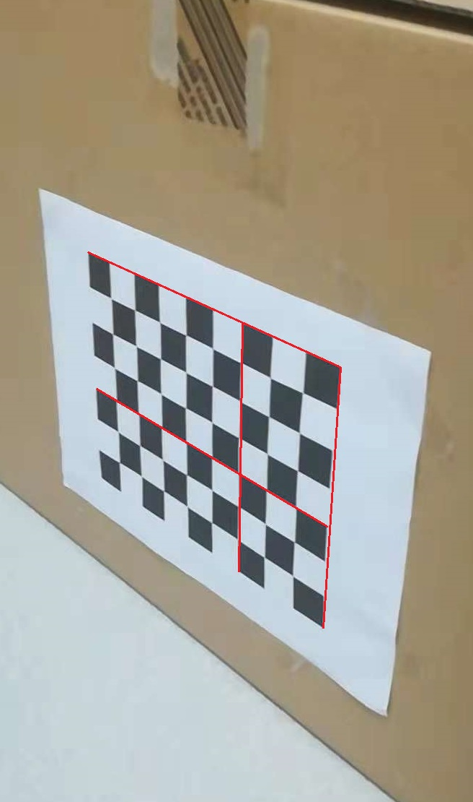

   ​                                                                               原始图像

   通过红色线标识可以观察到原始图像中标定纸中垂直方向上的直线因畸变而产生部分弯曲，而修正后图像则在水平和垂直方向上都保持了直线


2. #### 光流估计方法

   2.1.  目标

   - 在一段连续的图像中，由于摄像机的移动或所拍摄物体的移动，连续帧间某一图像对象的位移变化称为光流

     

     光流的成立基于假设：

     - 连续帧间同一目标对象所在像素的灰度值不变或变化很小
     - 相邻元素具有相同的运动

     第一帧图像中的某对象的像素$I_1(x,y)$在时间$dt$后移动到第二帧图像的$I_2(x+dx,y+dy)$像素上，根据像素灰度不变的假设，有：
     $$
     I(x,y,t) = I(x+dx, y+dy, t+dt)
     $$
     对等号右侧进行泰勒级数展开，消去相同项，两边都除以$ dt$，得到如下方程：
     $$
     \begin{array}{l}
     {f_x}u + {f_y}v + {f_t} = 0\;\\
     \left\{ \begin{array}{l}
     {f_x} = \frac{{\partial f}}{{\partial x}}\;;\;{f_y} = \frac{{\partial f}}{{\partial y}}\\
     u = \frac{{dx}}{{dt}}\;;\;v = \frac{{dy}}{{dt}}
     \end{array} \right.
     \end{array}
     $$
     对该光流方程，其中$f_x$和$f_y$是图像梯度，同样$f_t$是时间方向的梯度。其中$(u,v)$是待求解的像素光流方向，而由于有两个未知数，仅通过一点构成的方程无法求解。故需要LK等方法解决问题

   - 在一段视频中通过光流估计方法追踪某一图像对象。

   2.2.  Lucas-Kanade法

   - 因相邻元素具有相似运动的特性，Lucas-Kanade法根据图像某一对象的区域$3\times3$像素的9个点具有相同运动的前提，得到这9个点的光流方程，而又有这9个点共享同一运动，可以组成含2个未知数9个等式的方程组，由于估计含有偏差，而且约束条件多于求解对象，故采用最小二乘法拟合参数。
     $$
     \begin{bmatrix} u \\ v \end{bmatrix} = \begin{bmatrix} \sum_{i}{f_{x_i}}^2 & \sum_{i}{f_{x_i} f_{y_i} } \\ \sum_{i}{f_{x_i} f_{y_i}} & \sum_{i}{f_{y_i}}^2 \end{bmatrix}^{-1} \begin{bmatrix} - \sum_{i}{f_{x_i} f_{t_i}} \\ - \sum_{i}{f_{y_i} f_{t_i}} \end{bmatrix}
     $$
     
   2.3.  Horn-Schunck法

   - H-S法倾向于认为图像间的运动平滑，即就是让图像中的运动扭曲最小化，给出最平滑的结果。于是光流估计问题可以转化为如下全局扭曲能量的最小化问题：

     $$
     E = \iint \left[（I_{x} u + I_{y}v +I_{t}）^{2} +\alpha^{2}（\lVert\nabla u \rVert ^ {2} + \lVert \nabla v \rVert ^ {2}）\right] {{{\rm{d}}} x {{\rm {d}}} y}
     $$

   - 其中$I_x,I_y,I_t$是图像灰度在$x,y$和时间上的梯度，通过求解多维拉格朗日方程可以最小化该函数，即就是使：
     $$
     {\frac {\partial L} {\partial u}}  -  {\frac {\partial} {\partial x}} {\frac {\partial L} {\partial u_{x}}}  -  {\frac { \partial} {\partial y}} {\frac {\partial L} {\partial u_ {y}}} = 0\\{\frac {\partial L} {\partial v}}  -  {\frac {\partial} {\partial x}} {\frac {\partial L} {\partial v_ {x}}}  -  {\frac { \partial} {\partial y}} {\frac {\partial L} {\partial v_ {y}}} = 0\\其中L为全局扭曲能量的积分
     $$
     通过迭代完成对光流的估计。

   2.4.  结果评估

   - 实际在完成对图像一个区域进行跟踪的操作中，先提取出一部分特征角点，作为光流起始追踪点

     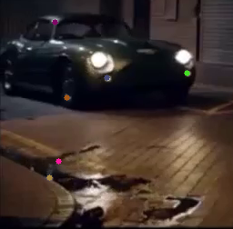

   - 然后通过光流估计法，在下一帧相邻图像中，在距离阈值范围内，寻找可靠临近点，并逐步更新特征角点位置，最后通过选取跟踪成功的点，估计物体在视频流中的运动轨迹

     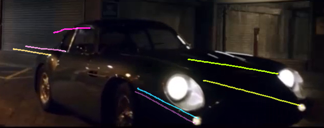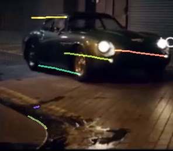

     ```python
      #初始特征角点位置
      ori_corners
      Out[3]: 
      array([[[ 65.80641 , 349.1025  ]],
             [[ 74.22933 , 279.04092 ]],
             [[ 61.41876 , 196.08736 ]],
             [[768.      ,  13.      ]],
             [[646.95703 , 123.981384]],
             [[555.      , 244.00003 ]],
             [[390.00357 , 240.99562 ]],
             [[807.      ,  24.      ]],
             [[502.00232 , 245.00471 ]]],...
      #相邻下一帧特征角点位置
      curr_corners
      Out[4]: 
      array([[[ 65.76564 , 349.14044 ]],
             [[ 74.24793 , 279.04755 ]],
             [[ 61.41005 , 196.09247 ]],
             [[767.98566 ,  13.006105]],
             [[646.9267  , 123.99193 ]],
             [[554.98694 , 243.9892  ]],
             [[390.00827 , 240.99213 ]],
             [[806.99896 ,  23.995987]],
             [[501.9852  , 244.99893 ]],...
      #帧间特征角点位移
      optiFlow
      Out[17]: 
      array([[[-4.07714844e-02,  3.79333496e-02]],
             [[ 1.86004639e-02,  6.62231445e-03]],
             [[-8.70895386e-03,  5.11169434e-03]],
             [[-1.43432617e-02,  6.10542297e-03]],
             [[-3.03344727e-02,  1.05438232e-02]],
             [[-1.30615234e-02, -1.08337402e-02]],
             [[ 4.69970703e-03, -3.49426270e-03]],
             [[-1.03759766e-03, -4.01306152e-03]],
             [[-1.71203613e-02, -5.78308105e-03]],...
     ```

   2.5. 失败样例

   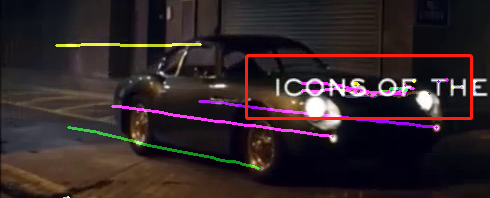

   ​	在光流跟踪的过程中，由于文字边缘在图像中有很强的灰度变化，因此文字也被提取为特征角点，但是当车向前移动导致车灯与文字重叠时，由于二者灰度相近，光流算法误判为物体发生了移动。

3. #### 尺度栅格地图视觉匹配

   3.1.  目标

   - 栅格地图拼接是创建大型环境模型的主流方法，对于多移动机器人系统，要解决此类问题，其实就是要通过两张栅格地图的共有部分，找到刚体变换$T$，通过$T$对给出的地图$P$进行旋转，平移变换，使栅格地图$P$与$Q$可以准确重合。一般的，在栅格地图具有相同尺度时，变换$T$由旋转矩阵$R$，以及关于$x,y$轴的平移分量$\vec x,\vec y$组成，即就是$T = \left\{ {R,t} \right\}$，其中$R$由地图绕其平面法线旋转的旋转角$\theta $的度数所决定，而$t$则是由平移距离决定:
     $$
     R = \left[ {\begin{array}{*{20}{c}}
     {\cos \theta }&{ - \sin \theta }\\
     {\sin \theta }&{\cos \theta }
     \end{array}} \right],t = \left[ {\begin{array}{*{20}{c}}
     {{t_x}}\\
     {{t_y}}
     \end{array}} \right]
     $$
     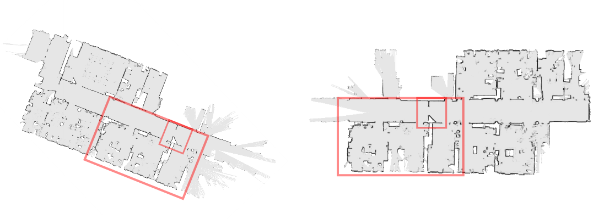

     即由图中红框表示的共同包含区域，计算出二者的变换矩阵$T = \left\{ {R,t} \right\}$

     传统算法步骤一般为：

     1. 作为图像配准以SIFT检测特征点（blob）
     2. 生成SIFT描述子
     3. 以描述子匹配特征点
     4. 通过RANSAC算法筛选正确匹配，并生成变换矩阵
     5. 通过裁剪ICP算法优化变换矩阵结果

   3.2.  算法原理

   1. 结合了图像处理中的特征角点与高斯拉布拉斯等方法与点云匹配中的点匹配扩展法，完成栅格地图的拼接

   2. 首先，角点作为栅格地图重要特征，所以在图片状态下采用基于尺度的Harris角点检测法Harris-Laplace作为角点检测器
      $$
      \left\{ {\begin{array}{*{20}{c}}
      {M = \sum\limits_{x,y} {w\left( {x,y} \right)\left[ {\begin{array}{*{20}{c}}
      {I_x^2}&{I_x^{}I_y^{}}\\
      {I_x^{}I_y^{}}&{I_y^2}
      \end{array}} \right]} }\\
      {\left| {LoG\left( {x,{\sigma _n}} \right)} \right| = \sigma _n^2\left| {{L_{xx}}\left( {x,{\sigma _n}} \right) + {L_{yy}}\left( {x,{\sigma _n}} \right)} \right|}
      \end{array}} \right.
      $$
      其中上式，$M$为Harris检测器响应值，$w$为检测窗口大小，右侧矩阵为图像灰度变化梯度检测子；下式为归一化Laplace of Gaussian响应，其中${\sigma _{\rm{n}}}$为当前尺度

      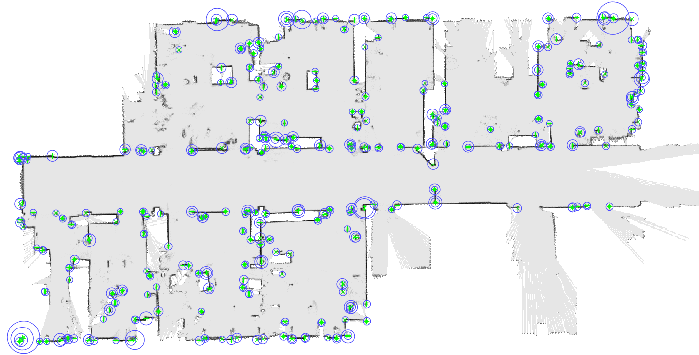

      上图即为一次对栅格地图采用Harris-Laplace检测后的结果，其中绿色标志为Harris角点，以其为圆心的蓝色圆注明了它所在的描述尺度。

   3. 为获得更稀疏的信息以描述特征角点，需要通过边缘提取的方法，采用Sobel边缘提取得到栅格地图的点云数据

      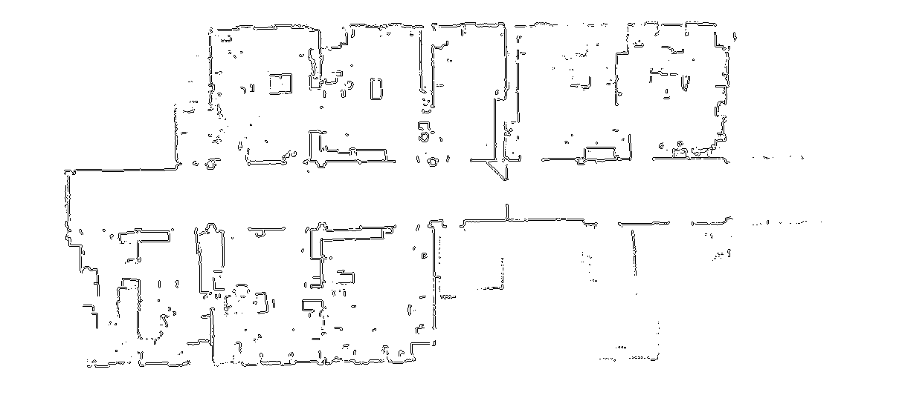

      得到由众多二维点组成的二维点云栅格地图作为描述数据，数据类型为$N \times 2$的矩阵，其中$N$为点云点总数量

   4. 对由第二步检测得到的特征角点，要生成其描述子必须有旋转不变性，平移不变性，尺度不变性，可重复性已经由Harris角点保证，而对于如下图不同尺度，不同旋转角度，不同的两帧栅格地图的共有部分上，相同的两个特征点，要生成相同的描述子，面临数个问题。

      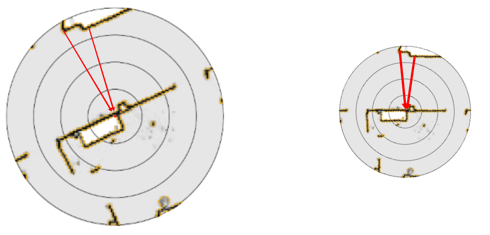

      图中两块区域分别代表不同尺度不同栅格图中某一相同的Harris-Laplace角点，圆的范围即就是该点所在的描述尺度，图中黄色点代表对栅格地图进行边缘提取后的的得到的点云，描述过程为统计特征角点在其尺度内所有二维点云到特征角点坐标的向量。

      ​	面临如下问题：

      - 区域内点云总数不同，由于起初两张栅格地图分辨率不同，而边缘提取得到点密度相同，故在不同大小的同一区域内点总量不同，即要统计的向量数不同
      - 描述向量长度不同，由于两图尺度不同，故相同物理位置间的向量长度在图片中不一样长
      - 不同地图间有旋转

      可以通过如下式的思路来解决：
      $$
      {C_l} = \frac{1}{{\left| {{S_l}} \right|}}\sum\limits_{{x_i} \in {S_l}} {\left( {\frac{{{x_i} - x}}{{Scal{e_l}}}} \right){{\left( {\frac{{{x_i} - x}}{{Scal{e_l}}}} \right)}^T}}
      $$
      其中$x_i$代表图中所有的黄色点，$x$代表中心待描述特征角点，${S_l}$代表在$l$描述范围下点的数量，在点总数不同，但地图中各个位置点密度相同的情况下，通过求取平均向量可以解决区域内点云总数不同问题

      对于第二步中获取到的具有尺度信息的Harris角点，进行向量统计时，首先将其除以当前特征角点所在尺度$Scale_l$，以解决描述向量长度不同问题。
      $$
      \left\{ {\begin{array}{*{20}{c}}
      {{C_l} = \left[ {\begin{array}{*{20}{c}}
      {{{\bar x}^2}}&{\overline {xy} }\\
      {\overline {xy} }&{{{\bar y}^2}}
      \end{array}} \right] \times scal{e^{ - 2}}}\\
      {\left[ {{s_1},{s_2}} \right],\;\;\left[ {{{\vec n}_1},{{\vec n}_2}} \right] = svd(C{}_l)}
      \end{array}} \right.
      $$
      两个公式中第一个公式为上式的推导，不同的是此处$x,y$分别代表黄色点指向中心特征角点的向量的$x,y$轴坐标值。对得到的描述向量统计矩阵，进行奇异值分解，将得到两个特征值，按大小排列后，可以作为具有旋转不变性的弱描述子。而相应特征向量随描述能力较强，但不具有旋转不变性

   5. 匹配与匹配对扩展

      首先进行弱描述子匹配，通过range-search算法寻找描述子相近的特征角点，得到含有部分错误匹配的匹配集合，接下来通过特征向量匹配来进行检测，但特征向量不具有旋转不变性，故不能直接使用，转而采用基于当前匹配与周围的扩展匹配间的特征向量夹角来实现
      $$
      \left\{ {\begin{array}{*{20}{c}}
      {\theta  = {{\cos }^{ - 1}}\left\langle {{n^{{x_i}}},{n^x}} \right\rangle }\\
      {y \in Q\bigcap {\left\{ {y|\left| {\frac{{{d^‘}}}{{{s^‘}}} - \frac{d}{s}} \right| < \varepsilon } \right\}} }
      \end{array}} \right.
      $$
      如下图：

      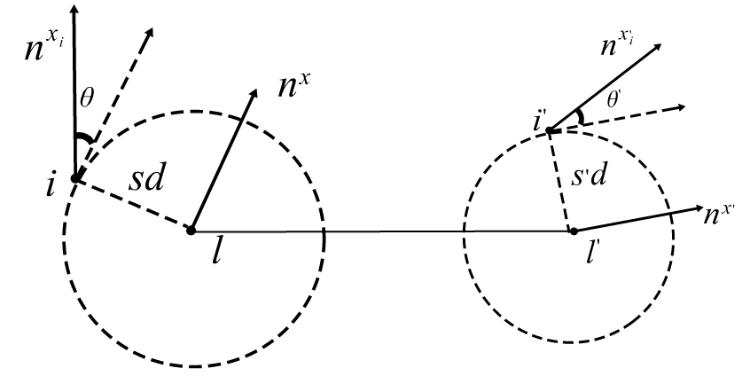

      

      式中其中$n^{x_i}$代表点i的特征向量，y代表候选可扩展点集，Q为除去当前中心点的所有特征角点集合，$d,d^,$为图像上中心点与扩展点距离，$s,s^,$为各自中心特征点的所在尺度，图中其中$l,l^‘$分别是待两幅栅格地图的相同位置的两点，各自的特征法向量指向不同，但假设这两点是正确匹配时，那么会有以下情况，左图中若有距离特征中心点$l\  k$远另一特征点$i$，那么考虑进尺度算子后，会在右图距离中心点$l^‘\ k\frac{{{s^{‘}}}}{s}$ 的位置上有同样一个特征角点，且两图中，特征中心点与扩展点的特征向量夹角$\theta$相同。

      故可根据此假设中特征向量夹角来解决特征向量不具有旋转不变性的问题。进行匹配对的扩展，得到的扩展对越多则该组匹配可靠度越高。

   6. 最后对组匹配采用Ransac算法去噪，通过得到的组匹配进行相对变换计算，再使用尺度裁剪ICP算法进行优化，得到最终结果

   3.3.  实验结果

   - 匹配对扩展

     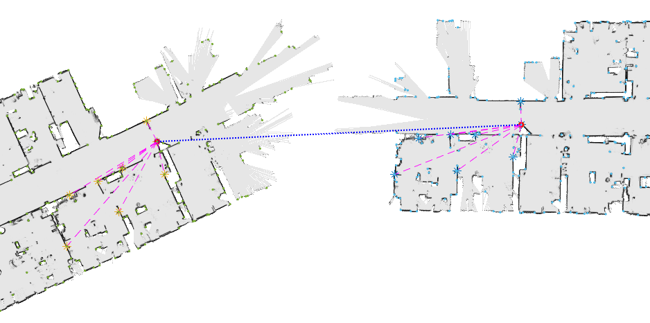

     其中两个中心红色圆圈分别代表两图的特征中心点，黄色和蓝色星标分别代表彼此的扩展点，每个扩展点在都在匹配中可以找到与其对应的扩展点

   - 匹配结果

     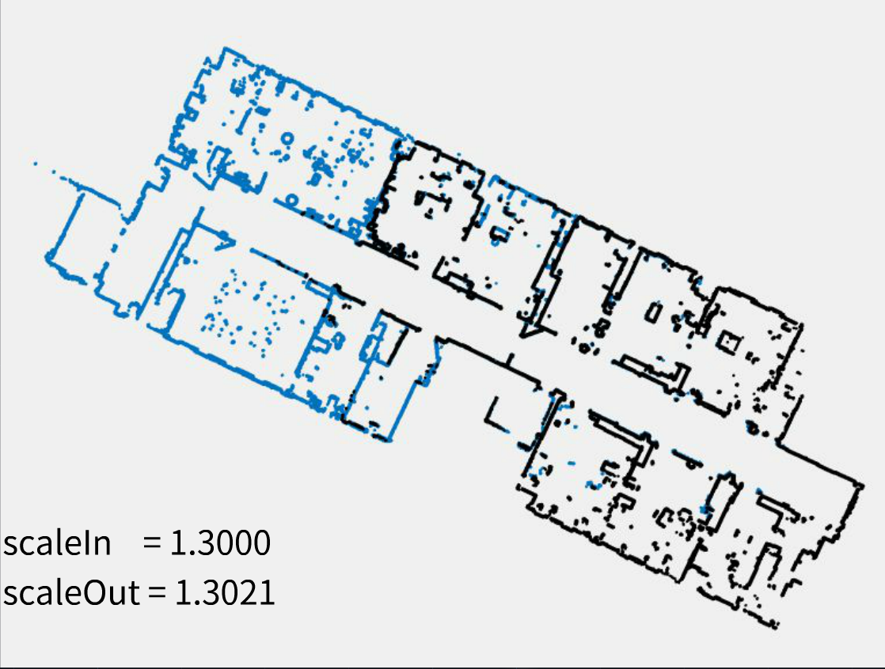

     对于输入比例差为$1:1.3$的两幅待拼接栅格地图，通过算法后完成拼接并估算出尺度比例为$1:1.3021$。

   

